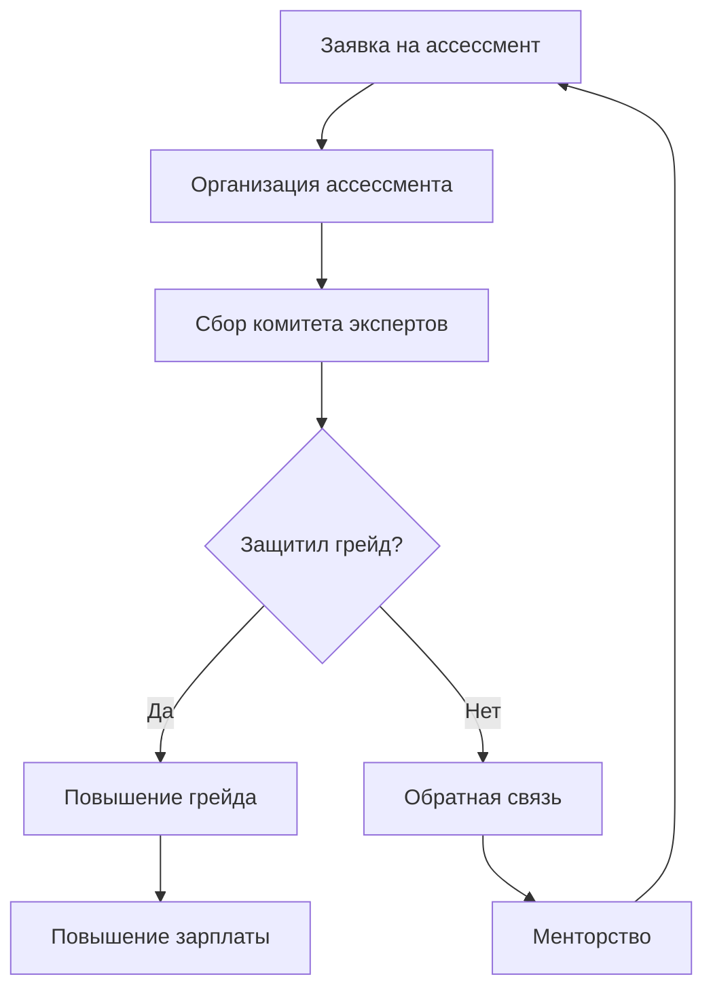

Открытые зарплатные вилки – это когда каждый миддл знает, сколько зарабатывают миддлы и другие грейды в той компании, где он работает. Условно говоря, получает специалист 1500$, но он знает, что вилка его уровня составляет от 1200$ до 2000$. Но просто взять и рассказать всем про деньги, которые они могут получать, нельзя. Мало знать возможности, нужно еще и понимать, как достигнуть ее. Для того, чтобы работники знали путь достижения нового грейда, компании нужно привести в порядок бизнес-процессы.

## 1. Открытая информация о грейдах коллег

Разработчик, зная свои навыки и грейд, сравнивает себя с коллегами. Например, джун, который хочет расти, ищет для себя ролевую модель. Он видит сеньора в команде и захочет стать таким же. Он будет задавать вопросы и обсуждать решения и по рабочему проекту, и по личным пет-проектам.

А чтобы новички в команде видели, кто сеньор среди коллег, компании нужна система с публичными профилями и грейдами. Это может быть внутренний интранет, собственное решение или купленное. Также в качестве заглушки используют слак, где каждый напишет в описании профиля свой грейд. В любом случае, разработчики компании должны видеть грейды других.

## 2. Открытые стандарты присвоения грейдов

Стандартификация грейдов позволит сравнивать умения специалистов в рамках одних компетенций. Каждый работник знает свой грейд и видит грейды коллег. Теперь ему нужно знать, что сделать для повышения грейда. Когда человек не знает, за что присвоен грейд, то он не знает и направление, куда двигаться. Помимо требований, человек заранее видит и задачи, которые выполняет сеньор в вашей компании: проведение собеседований, менторство над коллегами, консультации по другим проектам.

В интернете полно роадмапов разработчика для разных направлений. Если разработчики вашей компании следуют разным гайдам, то и сопоставить их навыки вам сложнее. Уделите время и проработайте стандарты грейдирования, чтобы работники знали, как им расти. Если они не будут понимать это, то они пойдут искать возможность в других проектах.

Важно создать такую систему, где разработчики могут посмотреть требование к грейдам для других специализаций. Возможно, кто-то захочет попробовать себя в другой области и захочет увидеть требования для нее. В рамках одной компании поменять специализацию человеку легче, ведь команда и люди ему знакомы, а процессы уже известны. Работник фокусируется только на освоении новой профессии и не будет тратить энергию на выстраивание взаимоотношений с новыми коллегами.

## 3. Политика для менторов и менти

Менторство – один из способов помощи обучающимся специалистам. Когда прокачиваешь навыки, необходима обратная связь: в нужную ли сторону ты двигаешься, правильно ли применяешь новые знания. Если же джуны не знают, как получить менторство, они пойдут искать такую возможность в других компаниях.

Чтобы люди росли в вашей команде, позаботьтесь о проработке политик менторства. Обдумайте и опишите процессы:

- как можно стать ментором,
- что нужно сделать, чтобы перестать быть ментором,
- какие требования выставляются менторам,
- какую часть рабочего времени можно уделять менторству,
- к кому можно обратиться, чтобы получить менторскую помощь
- как можно завершить менторскую программу по достижению цели или досрочно.

Люди, зная ответы на эти вопросы заранее, смогут более осознанно принять решение. А вдруг ваши потенциальные менторы и менти не знают, как завершить программу, если цели не достигнуты были и это их пугает? А вдруг они стесняются задавать такие вопросы? Дайте ответы на них, не дожидаясь озвучивания, и вы сделайте хорошо вашим менторам и менти.

Сам факт подготовки кандидата на повышение даст бонусы не только ему самому, но и вам. Разработчик пересмотрит свои знания и навыки, почерпнет новое и начнет применять их на практике еще до того, как грейд повышен. Для менти это практика и обратная связь, а для компании – эффективнее закрытые задачи.

Эксперты для комитета тоже держат себя в тонусе, ведь у них появляется еще один повод следить за развитием технологий и подходов кодинга. Им будет сложно задавать одни и те же вопросы из года в год в то время как технологии и языки программирования развиваются.

## 4. Политика проведения ассессментов

Ассессмент – это процедура повышения грейда. Он должен быть так же прозрачен, как и присвоение грейда на старте. Ассессмент похож на собеседование внутри компании – коллеги оценивают уровень кандидата на повышение.

Ассессмент проводят с участием незаинтересованных экспертов. Другие старшие разработчики судят об уровне навыков кандидата на повышение. Ментор лишь готовит кандидата, но не участвует в принятии решения. Каждый эксперт комитетапишет мнение о грейде кандидата. Если же кандидат не проходит порог достаточности, то ему предлагают материалы, как можно подготовиться к следующей попытке.

По результатам ассессмента важно дать структурированную обратную связь. Для этого нужно подготовить и экспертов, чтобы они оформляли фидбек по одному стандарту. В политике необходимо описать:

- организацию подготовки ассессмента,
- сбор комитета экспертов,
- организацию проведения ассессмента: онлайн, офлайн, место проведения,
- сроки, когда эксперты должны дать обратную связь,
- что делать в случае, если кандидат успешно прошел ассессмент:
	- процесс повышения грейда,
	- пересмотр зарплаты,
- что делать, если кандидат не смог защитить грейд:
	- проработка обратной связи с работником,
	- организация менторства по повторной подготовке.

Опишите эти процессы заранее, чтобы еще до начала подготовки работники знали что делать в том или ином случае.

## 5. Открытые зарплатные вилки по грейдам

Когда работники знают, какие грейды у коллег, как можно подготовиться к повышению и как получить новый грейд, они знают путь достижения цели. Теперь пришло время показать им цель. Они знают навыки и умения сеньора в компании, но какое за это вознаграждение? Покажите вилки грейдов, и тогда у работников будет вся информация.

Чтобы вилки были актуальны, следите за состоянием рынка. Если финансовое положение не дает вам платить выше рынка, то предложите нематериальные бонусы: свободный график, возможность работы из другой страны, техника на выбор. Проинформируйте работников об этом в политике по грейдированию.

Если ваша компания пока не может угнаться за рыночными вилками и новоиспеченный сеньор, не зная вилки грейда заранее, получит меньше ожидаемой суммы, то он будет разочарован. Новые знания разработчик получил, тайтл тоже, а вознаграждение не кажется ему соразмерным. Спустя какое-то время он начнет искать другие проекты и пойдет на собеседования. Опыт защиты грейда даст ему преимущество на интервью, и ему охотно предложат новый оффер на желаемый доход.

Открытая вилка покажет работникам, что компания не пытается скрыть выбивающиеся из грейдов зарплаты. Такую открытость и прозрачность в рыночных отношениях оценят.

## Заключение

Прозрачность процессов позволяет ответить на вопросы работников компании еще до того, как они решатся их задать. Каждый знает не только возможности заработка в компании, но и что ему нужно сделать для повышения. Открытие зарплатных вилок побудит пересмотреть процессы найма и удержания людей, а их развитие будет поставлено на поток.
